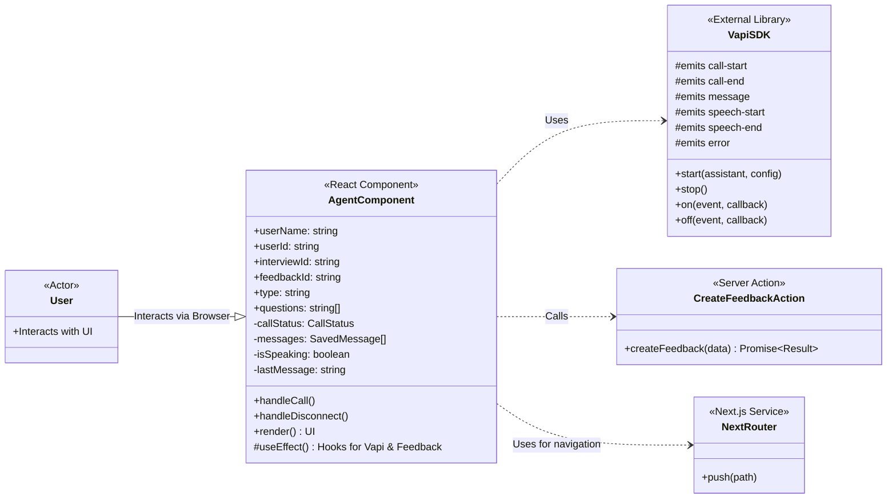
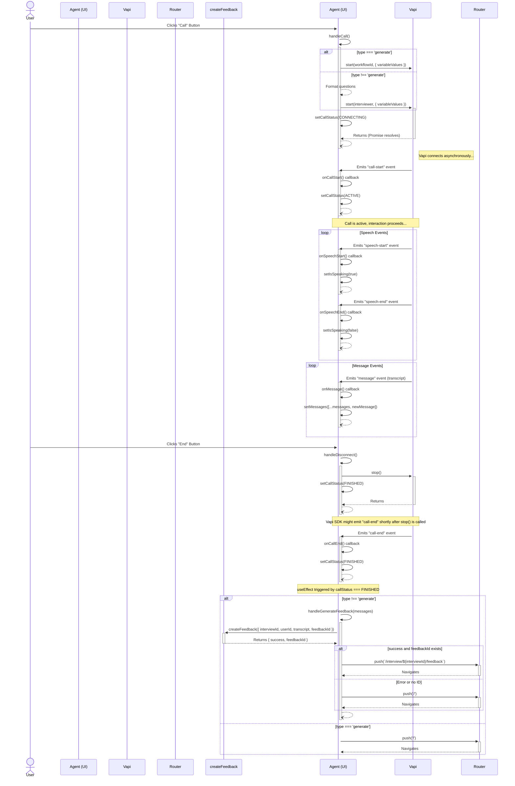

# AI Voice Interviewer

## Overview

This project is a web application designed to conduct voice-based interviews using an AI agent. Built with Next.js and leveraging the Vapi SDK for real-time voice communication, it allows users to interact with an AI interviewer, captures the conversation transcript, and can optionally generate feedback based on the interview session.

## Features

*   **Real-time Voice Interaction:** Engages users in a voice conversation with an AI.
*   **AI Speaking Indicator:** Provides visual feedback when the AI agent is speaking.
*   **Live Transcript Display:** Shows the latest recognized speech during the conversation.
*   **Call State Management:** Handles the lifecycle of the call (Inactive, Connecting, Active, Finished).
*   **Interview Modes:** Supports different modes, potentially including generating questions dynamically or using a predefined set.
*   **Transcript Storage & Feedback:** Saves the interview transcript and routes the user to a feedback page upon completion (in specific modes).
*   **Component-Based UI:** Uses React components for displaying user/AI avatars and managing call controls.

## Technology Stack

*   **Frontend:** Next.js, React, TypeScript
*   **Styling:** Tailwind CSS and shadcn
*   **Voice AI:** Vapi SDK
*   **Backend/Actions:** Next.js Server Actions

## Diagrams

### Component Interaction (Class Diagram)

### Call Flow (Sequence Diagram)

## Challenges Faced

*   **Real-time State Sync:** Managing and synchronizing the UI state (call status, transcript, speaking indicator) with asynchronous events from the Vapi SDK required careful handling of React state and effects.
*   **SDK Integration:** Correctly initializing, handling events (call start/end, messages, speech start/end, errors), and cleaning up listeners for the Vapi SDK within the React component lifecycle.
*   **Error Handling:** Implementing robust error handling for potential issues during the call (e.g., connection problems, API errors).
*   **Asynchronous Flow:** Orchestrating asynchronous operations like starting the call, receiving messages, and triggering feedback generation upon call completion.
*   **UI/UX for Voice:** Designing an intuitive interface for a primarily voice-driven interaction.

## Lessons Learned

*   **State Management in Real-time Apps:** The importance of robust state management (like `useState`, `useEffect`) for handling asynchronous events and maintaining UI consistency.
*   **Third-Party SDKs:** Best practices for integrating and managing the lifecycle of external SDKs within a React/Next.js application.
*   **Event Handling:** Effective use of event listeners and cleanup functions to prevent memory leaks and unexpected behavior.
*   **Asynchronous Programming:** Deeper understanding of `async/await` and Promise handling in JavaScript/TypeScript for managing API calls and background processes.
*   **Component Design:** Structuring React components to encapsulate related logic and state (e.g., the `Agent` component managing the entire call flow).

---

